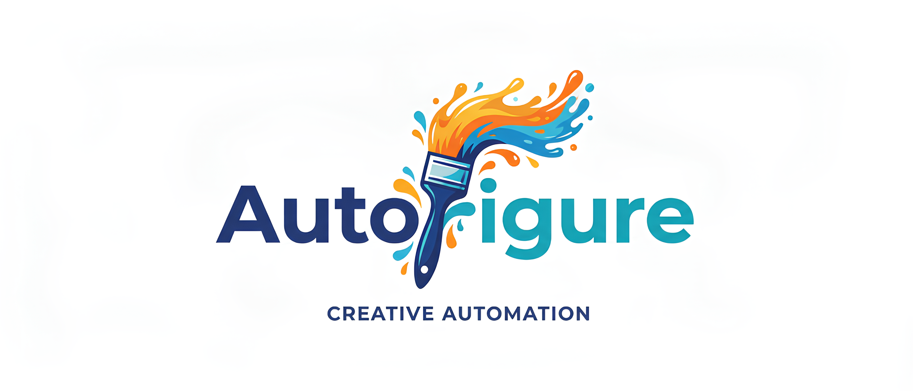
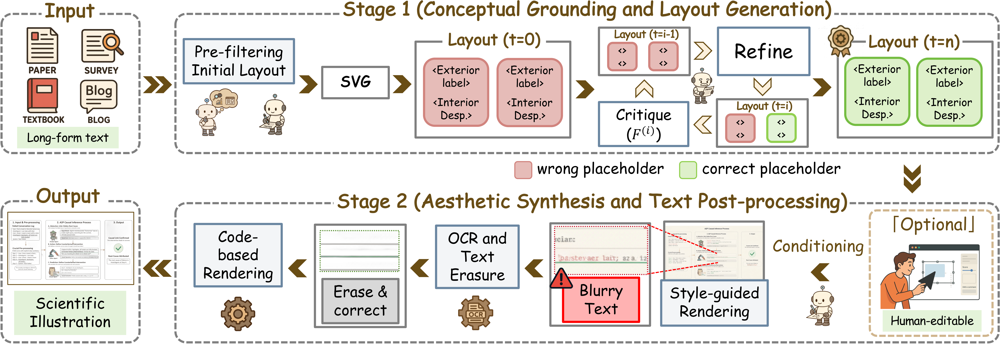

<div align="center">




# AutoFigure: Generating and Refining Publication-Ready Scientific Illustrations [ICLR 2026]

[](https://openreview.net/forum?id=5N3z9JQJKq)
[](https://opensource.org/licenses/MIT)
[](https://www.python.org/)
[](https://huggingface.co/datasets/WestlakeNLP/FigureBench)
[](https://deepscientist.cc/)

<p align="center">
  <strong>From Text to Publication-Ready Diagrams</strong><br>
  AutoFigure is an intelligent system that leverages Large Language Models (LLMs) with iterative refinement to generate high-quality scientific figures from text descriptions or research papers.
</p>

[Quick Start](#-quick-start) • [Web Interface](#-web-interface) • [Configuration](#%EF%B8%8F-configuration) • [API Reference](#-api-reference)

</div>

---


https://github.com/user-attachments/assets/d0c954a9-9cf3-4c8b-8b04-71d75a68854c


## 🔥 News

- **[2026.03.24]** 🧠 Our sister project **DeepScientist v1.5** is now officially released. It is a local-first open-source autonomous research system for end-to-end scientific discovery. Explore it on [GitHub](https://github.com/ResearAI/DeepScientist) or read the [ICLR 2026 paper](https://openreview.net/forum?id=cZFgsLq8Gs).
- **[2026.03.11]** 📄 Our **AutoFigure-Edit** paper is now available on [arXiv](https://arxiv.org/pdf/2603.06674) and featured in 🤗[Hugging Face Daily Papers](https://huggingface.co/papers/2603.06674)! If you find our work helpful, please consider giving us an **upvote** on Hugging Face and **citing** our paper. Thank you! ❤️
- **[2026.02.17]** 🚀 The **AutoFigure-Edit online platform** is now live! It is free for all scholars to use. Try it out at [deepscientist.cc](https://deepscientist.cc) or check out our open-source code on [GitHub](https://github.com/ResearAI/AutoFigure-Edit). This new Edit version achieves much better performance!
- **[2026.01.26]** 🎉 AutoFigure has been accepted to **ICLR 2026**! You can read the paper on [arXiv](https://arxiv.org/abs/2602.03828).
---

## ✨ Features

| Feature                    | Description                                                                      |
| :------------------------- | :------------------------------------------------------------------------------- |
| 📝 **Text-to-Figure**       | Generate figures directly from natural language descriptions.                    |
| 📄 **Paper-to-Figure**      | Extract methodology from PDFs and create visual diagrams automatically.          |
| 🔄 **Iterative Refinement** | Dual-agent system (Generation + Evaluation) for continuous quality optimization. |
| 🎨 **Multiple Formats**     | Output as **SVG** or **mxGraph XML** (fully compatible with draw.io).            |
| 💅 **Image Enhancement**    | Optional AI-powered post-processing for aesthetic beautification.                |
| 🖥️ **Web Interface**        | Interactive Next.js frontend for easy generation and editing.                    |

---

## 🚀 How It Works

AutoFigure employs a **Review-Refine** loop to ensure high accuracy and aesthetic quality.

<div align="center">

</div>

> **Process:**
> 1. **Generate:** The agent creates initial SVG/XML based on description & references.
> 2. **Evaluate:** The critic scores quality (0-10) and provides specific feedback.
> 3. **Refine:** The loop continues until the figure meets publication standards.

---

## 🌟 Generated Examples

Here are examples of figures generated by AutoFigure across different domains, showcasing its versatility in handling various levels of complexity.

|                                  Category & Visualization                                  |
| :----------------------------------------------------------------------------------------: |
|     **📄 Paper Case**<br>      |
|    **📊 Survey Case**<br>    |
|       **📝 Blog Case**<br>       |
| **📘 Textbook Case**<br> |

---

## ⚡ Quick Start

### Option 1: Python SDK (Recommended)


You can install via cloning the repo:

```bash
git clone https://github.com/ResearAI/AutoFigure.git
cd AutoFigure
pip install -e .
playwright install chromium  # Required for rendering
```

#### 1. Basic Usage (Text-to-Figure)

```python
from autofigure import AutoFigureAgent, Config

# 1. Configure
config = Config(
    generation_api_key="your-api-key",
    generation_provider="openrouter",  # options: 'openrouter', 'gemini', 'bianxie'
    generation_model="google/gemini-3.1-pro-preview",
)

# 2. Generate
agent = AutoFigureAgent(config)
result = agent.generate(
    description="A flowchart showing transformer training pipeline",
    max_iterations=5,
    output_format="svg",
    topic="paper" # 'paper', 'survey', 'blog', 'textbook'
)

print(f"✅ Generated: {result.svg_path} (Score: {result.final_score}/10)")
```

#### 2. Generate from Paper (PDF/Markdown)

Extract methodology from a paper and generate a figure automatically.

```python
# Generate figure from paper (PDF or Markdown)
result = agent.generate_from_paper(
    paper_path="./paper.pdf",
    max_iterations=5,
    output_format="svg",
    enable_enhancement=True, # Enhance the result
)

if result.success:
    print(f"Extracted methodology: {result.methodology_text[:200]}...")
    print(f"Generated figure: {result.svg_path}")
```

#### 3. With Image Enhancement

Generate multiple enhanced aesthetic variants of the figure.

```python
result = agent.generate(
    description="Neural network architecture diagram",
    enable_enhancement=True,
    enhancement_count=3,     # Generate 3 variants
    art_style="Modern scientific illustration with clean lines",
    enhancement_input_type="code2prompt" # Best quality mode
)

if result.success:
    print(f"Original Preview: {result.preview_path}")
    print(f"Enhanced variants: {result.enhanced_paths}")
```

### Option 2: Web Interface

Ideally suited for visual interaction and editing.

#### Windows

Run the backend and frontend in two terminals. This is the most explicit and portable way to start the web app.

1. Terminal 1 - backend: (Replace `YOUR_ENV_NAME` with the Python environment where AutoFigure dependencies are installed. If that environment is already active, skip the `conda activate` line.)
```powershell
conda activate YOUR_ENV_NAME
$env:AUTOFIGURE_BACKEND_PORT = "8796"
$env:AUTOFIGURE_HOST = "127.0.0.1"
cd backend
python app.py
```

2. Terminal 2 - frontend:
```powershell
cd frontend
$env:NEXT_PUBLIC_AUTOFIGURE_BACKEND_URL = "http://127.0.0.1:8796"
# Optional: remote PDF-to-Markdown service. If unset, local browser extraction is used.
# $env:PDF_API_URL = "https://your-pdf-service.example.com/pdf-to-markdown"
npm run dev
```

3. Then open `http://127.0.0.1:6002` in your browser.
4. To stop the web app, press `Ctrl+C` in both terminals. If a previous run left ports occupied, stop those processes explicitly:

```powershell
$ports = @(8796, 6002)
Get-NetTCPConnection -LocalPort $ports -State Listen -ErrorAction SilentlyContinue |
    Select-Object -ExpandProperty OwningProcess -Unique |
    ForEach-Object { Stop-Process -Id $_ -Force }
```

`PDF_API_URL` is optional. Configure it only if you have a remote service that
accepts a `POST` form field named `pdf_file` and returns JSON with a `markdown`
field. When it is not configured, uploaded PDFs are processed with local browser
text extraction.

#### Linux/MacOS

```bash
./start.sh
# Then open http://localhost:6002 in your browser
```

---

## 📊 FigureBench Dataset

We introduce **FigureBench**, the first large-scale benchmark for generating scientific illustrations from long-form text.

<div align="center">

</div>

### Dataset Overview

| Category       |  Samples  | Avg. Tokens | Text Density |     Complexity      |
| :------------- | :-------: | :---------: | :----------: | :-----------------: |
| 📄 **Paper**    |   3,200   |   12,732    |    42.1%     |        High         |
| 📝 **Blog**     |    20     |    4,047    |    46.0%     |         Med         |
| 📊 **Survey**   |    40     |    2,179    |    43.8%     |        High         |
| 📘 **Textbook** |    40     |     352     |    25.0%     |         Low         |
| **Total**      | **3,300** |  **10k+**   |  **41.2%**   | **~5.3 Components** |

### Download
<div align="left">
  <a href="https://huggingface.co/datasets/WestlakeNLP/FigureBench">
    
  </a>
</div>

```python
from datasets import load_dataset
dataset = load_dataset("WestlakeNLP/FigureBench")
```

---

## ⚙️ Configuration

AutoFigure is highly configurable. You can set these in `Config()` or via environment variables.

### Supported LLM Providers

| Provider       | Base URL                | Recommended Text / SVG Model    | Recommended Image Model                 |
| -------------- | ----------------------- | ------------------------------- | --------------------------------------- |
| **OpenRouter** | `openrouter.ai/api/v1`  | `google/gemini-3.1-pro-preview` | `google/gemini-3.1-flash-image-preview` |
| **Bianxie**    | `api.bianxie.ai/v1`     | `gemini-3.1-pro-preview`        | `gemini-3.1-flash-image-preview`        |
| **Google**     | `generativelanguage...` | `gemini-3.1-pro-preview`        | `gemini-3.1-flash-image-preview`        |

### Third-Party API Compatibility

AutoFigure can work with third-party model providers as long as their endpoint matches one of the supported API protocols:

| Third-Party API Type               | Web UI Provider | Protocol          | Base URL Format                                                                                         |
| ---------------------------------- | --------------- | ----------------- | ------------------------------------------------------------------------------------------------------- |
| OpenAI-compatible chat/completions | Custom          | OpenAI Compatible | Base path such as `https://provider.example.com/v1`; AutoFigure appends `/chat/completions` when needed |
| Gemini native generateContent      | Custom          | Gemini Native     | Base path ending at the Gemini API version, such as `https://provider.example.com/api/v1/gemini/v1beta` |

For Gemini Native providers, do not include the model name in the model field's base URL. Endpoints ending in `/models` are normalized automatically, but the recommended input is the version-level base URL.
For example, if a provider documents `https://provider.example.com/api/v1/gemini/v1beta/models`, enter:
```text
Provider: Custom
Protocol: Gemini Native
Base URL: https://provider.example.com/api/v1/gemini/v1beta
Model: gemini-3.1-pro-preview
```

### Web UI Model Mapping

The web interface separates text/SVG generation models from image generation
models across different dialogs:

| Web UI Location                               | Purpose                                  | Use This README Column       |
| --------------------------------------------- | ---------------------------------------- | ---------------------------- |
| Settings -> General -> Methodology Extraction | Extract core method text from papers     | Recommended Text / SVG Model |
| Settings -> LLM -> Layout Generation LLM      | Generate and iterate mxGraph XML layouts | Recommended Text / SVG Model |
| Beautification -> Code2Prompt LLM API         | Convert XML/code into an image prompt    | Recommended Text / SVG Model |
| Beautification -> Image Generation API        | Generate beautified raster images        | Recommended Image Model      |

If generation fails while creating the initial mxGraph XML, check the
`Settings -> LLM -> Layout Generation LLM` configuration. The image model is
only used later during beautification.

### Generation Settings

| Option                | Description                                 | Default          |
| --------------------- | ------------------------------------------- | ---------------- |
| `generation_api_key`  | API key for figure generation               | Required         |
| `generation_base_url` | Base URL for API                            | Provider default |
| `generation_model`    | Model name                                  | Provider default |
| `generation_provider` | Provider: 'openrouter', 'bianxie', 'gemini' | 'openrouter'     |

### Methodology Extraction Settings

| Option                 | Description                         | Default            |
| ---------------------- | ----------------------------------- | ------------------ |
| `methodology_api_key`  | API key for methodology extraction  | Same as generation |
| `methodology_model`    | Model for methodology extraction    | Same as generation |
| `methodology_provider` | Provider for methodology extraction | Same as generation |

### Enhancement Settings

| Option                   | Description                               | Default          |
| ------------------------ | ----------------------------------------- | ---------------- |
| `enhancement_api_key`    | API key for image enhancement             | None             |
| `enhancement_provider`   | Enhancement provider                      | 'openrouter'     |
| `enhancement_model`      | Model for image enhancement               | Provider default |
| `enhancement_input_type` | Input type: 'none', 'code', 'code2prompt' | 'code2prompt'    |
| `enhancement_count`      | Number of enhanced variants to generate   | 1                |
| `art_style`              | Art style description for enhancement     | ''               |

### Pipeline Settings

| Option              | Description                   | Default               |
| ------------------- | ----------------------------- | --------------------- |
| `max_iterations`    | Maximum refinement iterations | 5                     |
| `quality_threshold` | Quality threshold (0-10)      | 9.0                   |
| `output_dir`        | Output directory              | './autofigure_output' |
| `custom_references` | Custom reference figure paths | None                  |

---

## 📚 API Reference

### `generate()` Parameters

| Parameter                | Description                                         |
| ------------------------ | --------------------------------------------------- |
| `description`            | Text description of the figure to generate          |
| `max_iterations`         | Maximum iterations (overrides config)               |
| `output_format`          | 'svg' or 'mxgraphxml'                               |
| `quality_threshold`      | Quality threshold (overrides config)                |
| `enable_enhancement`     | Whether to enhance the final image                  |
| `art_style`              | Art style for enhancement (overrides config)        |
| `enhancement_input_type` | 'none', 'code', or 'code2prompt' (overrides config) |
| `enhancement_count`      | Number of enhanced variants (overrides config)      |
| `topic`                  | Content type: 'paper', 'survey', 'blog', 'textbook' |
| `custom_references`      | Custom reference figure paths                       |

### `generate_from_paper()` Parameters

Accepts all parameters from `generate()` plus:

| Parameter              | Description                                |
| ---------------------- | ------------------------------------------ |
| `paper_path`           | Path to paper file (PDF or Markdown)       |
| `methodology_api_key`  | API key for extraction (overrides config)  |
| `methodology_provider` | Provider for extraction (overrides config) |

### Result Object (`GenerationResult`)

| Attribute          | Description                        |
| ------------------ | ---------------------------------- |
| `success`          | Whether generation was successful  |
| `svg_path`         | Path to generated SVG file         |
| `mxgraph_path`     | Path to generated mxGraph XML file |
| `preview_path`     | Path to PNG preview image          |
| `enhanced_paths`   | List of all enhanced image paths   |
| `final_score`      | Final quality score (0-10)         |
| `methodology_text` | Extracted methodology (from paper) |
| `error`            | Error message if failed            |

### Enhancement Modes

| Mode          | Description                                                        |
| ------------- | ------------------------------------------------------------------ |
| `none`        | Direct beautification without code reference                       |
| `code`        | Use generated code (SVG/XML) as reference                          |
| `code2prompt` | Use LLM to analyze code and generate detailed prompt (recommended) |

---

## 📁 Project Structure

<details>
<summary>Click to expand directory tree</summary>

```
AutoFigure/
├── autofigure/              # 📦 Python SDK
│   ├── agent.py             # Main Agent
│   ├── generator.py         # Generation Pipeline
│   ├── enhancer.py          # Image Enhancement
│   └── extractor.py         # PDF Method Extraction
├── frontend/                # 🖥️ Next.js Web UI
├── backend/                 # 🔌 Flask API Server
├── scripts/                 # 🛠️ Utility Scripts
└── pyproject.toml           # Config
```
</details>

---

## 🤝 Community & Support

**WeChat Discussion Group**
Scan the QR code to join our community. If the code is expired, please add WeChat ID `nauhcutnil` or contact `tuchuan@mail.hfut.edu.cn`.
<table>
  <tr>
    <td></td>
  </tr>
</table>
---

## 📜 Citation & License

If you use **AutoFigure**, **AutoFigure-Edit**, or **FigureBench** in your research, please cite:

```bibtex
@inproceedings{zhu2026autofigure,
    title={AutoFigure: Generating and Refining Publication-Ready Scientific Illustrations},
    author={Minjun Zhu and Zhen Lin and Yixuan Weng and Panzhong Lu and Qiujie Xie and Yifan Wei and Sifan Liu and Qiyao Sun and Yue Zhang},
    booktitle={The Fourteenth International Conference on Learning Representations},
    year={2026},
    url={https://openreview.net/forum?id=5N3z9JQJKq}
}

@misc{lin2026autofigureeditgeneratingeditablescientific,
    title={AutoFigure-Edit: Generating Editable Scientific Illustration},
    author={Zhen Lin and Qiujie Xie and Minjun Zhu and Shichen Li and Qiyao Sun and Enhao Gu and Yiran Ding and Ke Sun and Fang Guo and Panzhong Lu and Zhiyuan Ning and Yixuan Weng and Yue Zhang},
    year={2026},
    eprint={2603.06674},
    archivePrefix={arXiv},
    primaryClass={cs.CV},
    url={https://arxiv.org/abs/2603.06674},
}
```

Repository metadata and usage guidance:

- [CITATION.cff](./CITATION.cff)
- [Citation and attribution guidance](./CITATION_AND_ATTRIBUTION.md)
- [Name and logo usage](./TRADEMARK.md)

This project is licensed under the MIT License - see `LICENSE` for details.
Name and logo usage are covered separately in `TRADEMARK.md`.

---

## More From ResearAI

Explore more open-source research tools from ResearAI:

| Project                                                                  | What it does                           |
| ------------------------------------------------------------------------ | -------------------------------------- |
| [DeepScientist](https://github.com/ResearAI/DeepScientist)               | autonomous scientific discovery system |
| [AutoFigure-Edit](https://github.com/ResearAI/AutoFigure-Edit)           | editable vector paper figures          |
| [DeepReviewer-v2](https://github.com/ResearAI/DeepReviewer-v2)           | review papers and drafts               |
| [Awesome-AI-Scientist](https://github.com/ResearAI/Awesome-AI-Scientist) | curated AI scientist landscape         |

---

The optimal configuration for this project uses `gemini-3.1-flash-image-preview` from Google AI Studio [[https://aistudio.google.com/](https://aistudio.google.com/)] as the image generation model and `gemini-3.1-pro-preview` as the Text model. Each run costs approximately $0.50, consumes about 30,000 tokens, and takes around 20 minutes.

[Mainland China Notice] Gemini's Terms of Service do not permit access or usage by users in mainland China. If OpenRouter throws an error, it is often because an account registered in mainland China lacks the necessary permissions to use Gemini. It is recommended to use an OpenRouter account registered in the United States or Europe and to ensure compliant usage.
